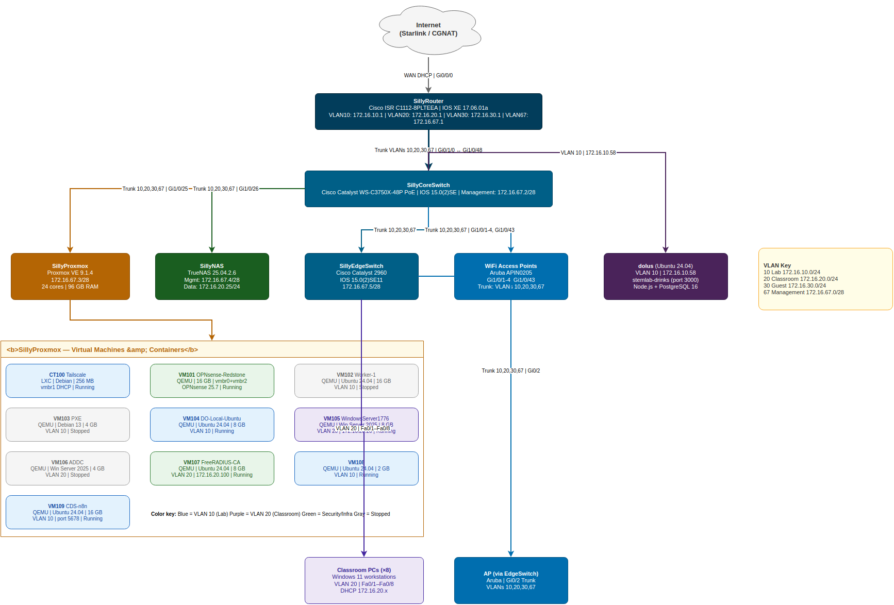
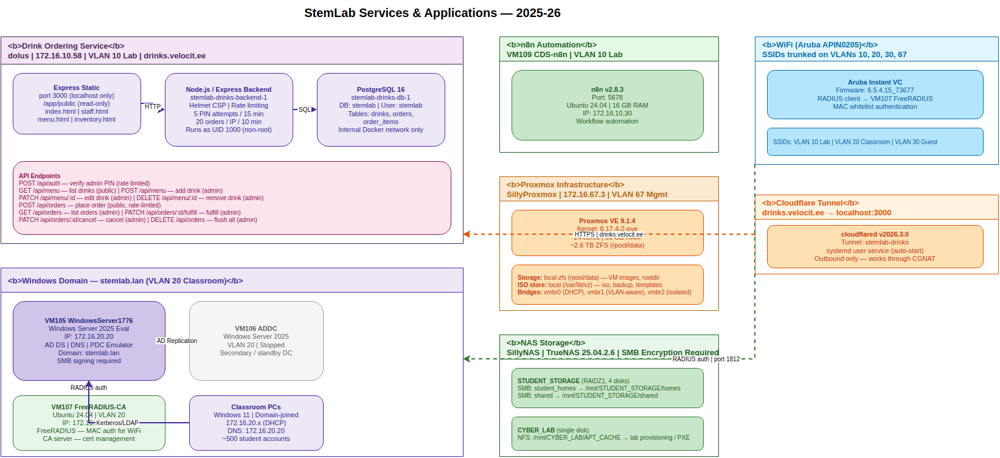

# Stemlab 25-26

After the 2024-2025 school year, the leading members of WHS Cyber collectively decided to purge the former Stemlab network and services and build from the ground up. This repository contains the progress, configurations, and topology of the new network so it will be easier for future generations of WHS Cyber to maintain.

| Resource | File |
|----------|------|
| Program Student Guidelines | [WHS-Cyber-Student-Guidelines.docx](resources/WHS-Cyber-Student-Guidelines.docx) |
| Donated Resources / Equipment | [WHS-Cyber-Donated-Resources.xlsx](resources/WHS-Cyber-Donated-Resources.xlsx) |
| Cyber Laptop Inventory | [Cyber-Laptop-Inventory.xlsx](resources/Cyber-Laptop-Inventory.xlsx) |
| Robotics & Coding Laptop Inventory | [Robotics-Laptop-Inventory.xlsx](resources/Robotics-Laptop-Inventory.xlsx) |

### Service Repositories

| Service | Repo | Description |
|---------|------|-------------|
| stemlab-drinks | [Wiesbaden-Cyber/stemlab-drinks](https://github.com/Wiesbaden-Cyber/stemlab-drinks) | Drink ordering service (Node.js + PostgreSQL) |

---

## Network Summary

**Domain:** `stemlab.lan`
**Internet:** Starlink (CGNAT — no inbound port forwarding)
**Remote access:** Tailscale VPN overlay

### VLANs

| VLAN | Name | Subnet | Gateway |
|------|------|--------|---------|
| 10 | Lab | 172.16.10.0/24 | 172.16.10.1 |
| 20 | Classroom | 172.16.20.0/24 | 172.16.20.1 |
| 30 | Guest | 172.16.30.0/24 | 172.16.30.1 |
| 67 | Management | 172.16.67.0/28 | 172.16.67.1 |

### Infrastructure

| Device | Role | IP | Hardware | OS/Version |
|--------|------|----|----------|------------|
| SillyRouter | WAN edge, NAT, DHCP | 172.16.67.1 | Cisco ISR C1112-8PLTEEA | IOS XE 17.06.01a |
| SillySwitch | Core L2 switch, 48-port PoE | 172.16.67.2 | Cisco Catalyst WS-C3750X-48P | IOS 15.0(2)SE |
| SillyProxmox | Hypervisor | 172.16.67.3 | 24-core, 96 GB RAM, ~2.6 TB ZFS | Proxmox VE 9.1.4 |
| SillyNAS | Network storage | 172.16.67.4 | 4-NIC, RAIDZ1 + single disk | TrueNAS 25.04.2.6 |
| SillyEdgeSwitch | Classroom edge switch | 172.16.67.5 | Cisco Catalyst 2960 | IOS 15.0(2)SE11 |

For full topology and details see [`docs/network-overview.md`](docs/network-overview.md).
For security hardening log and pending items see [`docs/security.md`](docs/security.md).
For a complete from-scratch rebuild guide see [`docs/setup-guide.md`](docs/setup-guide.md).

## Topology

### Network Layout


### Services & Applications


> Diagrams created with [draw.io](https://app.diagrams.net).

---

## Repository Structure

```
configs/
├── SillyRouter.cfg                    # Cisco ISR 1100 running config
├── SillySwitch.cfg                    # Cisco C3750X running config (core)
├── SillyEdgeSwitch.cfg                # Cisco 2960 running config (classroom)
├── proxmox/
│   ├── network-interfaces.conf        # /etc/network/interfaces
│   ├── storage.cfg                    # Proxmox storage pools
│   └── vms-and-containers.md          # VM/CT inventory
└── nas/
    └── SillyNAS.md                    # TrueNAS network, pools & shares
docs/
├── network-overview.md                # Full topology & notes
├── stemlab-drinks.md                  # Drink ordering service — API, DB schema, deployment
├── windows-domain.md                  # Windows domain, DC VMs, FreeRADIUS
└── guides/
    ├── aruba-ap-setup.md              # Aruba APIN0205 OS upgrade & IAP config
    ├── aruba-tftp-server.md           # TFTP server setup (for AP firmware)
    ├── aruba-radius-whitelist.md      # FreeRADIUS MAC whitelist for Aruba SSIDs
    └── domain-join.md                 # How to join Windows 11 to the domain
topology/
├── network-topology.drawio            # Physical/logical network diagram (draw.io)
└── services-diagram.drawio            # Services & applications layer (draw.io)
resources/
├── WHS-Cyber-Student-Guidelines.docx  # Program student guidelines
├── WHS-Cyber-Donated-Resources.xlsx   # Equipment & donated resources inventory
├── Cyber-Laptop-Inventory.xlsx        # Cyber laptop inventory
└── Robotics-Laptop-Inventory.xlsx     # Robotics & coding laptop inventory
```
